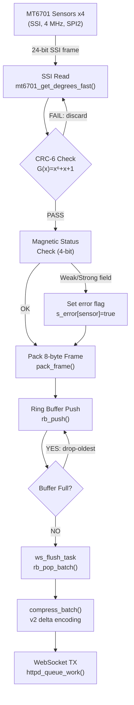
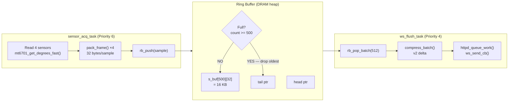
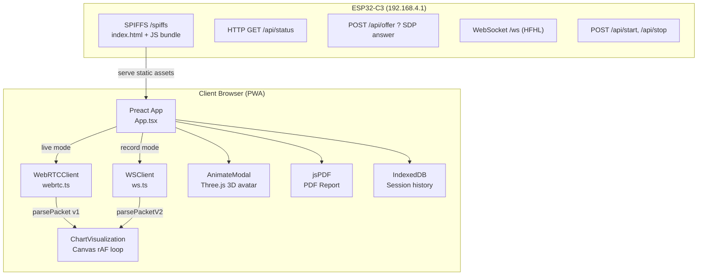
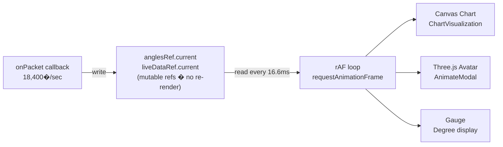
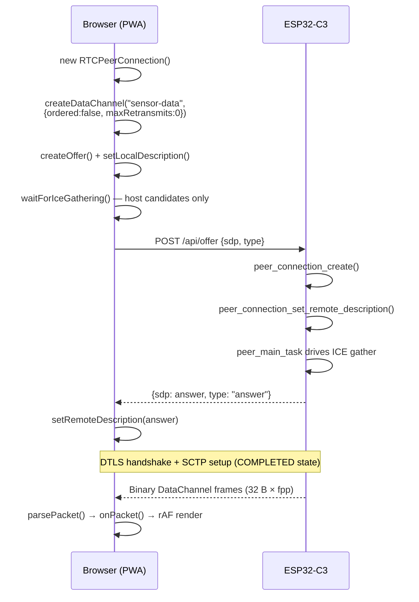

# Technical Implementation — Modular Electrogoniometer
## Chapter 4 Supplement: Results & Discussion

**Authors:** Niño James A. Tan, Krishia T. Sayson, Jacenfa O. Dayangco
**Adviser:** Engr. David Matthew A. Derit
**Institution:** Cebu Technological University — Main Campus
**Date:** December 2025

---

> This document narrates the technical journey of Chapter 4. Beginning from the
> proposals laid out in Chapter 3, it walks through every design decision,
> implementation challenge, and resolved trade-off — supported by architecture
> diagrams, signal-flow walkthroughs, and verbatim code excerpts from the
> ESP32-C3 firmware and the Progressive Web Application (PWA).

---

## Table of Contents
1. [Firmware Pipeline & Signal Integrity](#1-firmware-pipeline--signal-integrity)
2. [Asynchronous Buffering & Telemetry Optimization](#2-asynchronous-buffering--telemetry-optimization)
3. [Clinical Web Interface (PWA)](#3-clinical-web-interface-pwa)
4. [System Performance Summary](#4-system-performance-summary)
5. [Implementation History: Challenges & Fixes](#5-implementation-history-challenges--fixes)
6. [Wins Over Chapter 3 & Remaining Limitations](#6-wins-over-chapter-3--remaining-limitations)
7. [Recommendations for Future Studies](#7-recommendations-for-future-studies)

---

## 1. Firmware Pipeline & Signal Integrity

### 1.1 Overview

Chapter 3 proposed that the microcontroller layer would handle everything from raw
sensor polling to wireless dispatch — a continuous chain of responsibility that could
not afford a single dropped sample. When implementation began, two non-negotiable
constraints shaped every subsequent decision: the SSI bus acquisition must never be
stalled by network latency, and every byte leaving the device must be verifiably correct.

To honour those constraints, the firmware was structured as a deterministic,
multi-stage pipeline on the ESP32-C3, converting raw magnetic field measurements
into time-stamped, error-verified kinematic frames ready for wireless transmission.
The work was divided among three FreeRTOS tasks running at distinct priority levels,
each owning exactly one stage of the pipeline so that a slow network could never
reach back and starve a fast sensor.

The pipeline runs across three FreeRTOS tasks at distinct priority levels:

| Task | Priority | Role |
|---|---|---|
| `sensor_acq_task` | 6 (highest) | Polls all 4 MT6701 sensors via SSI |
| `peer_main_task` | 6 | Drives the libpeer WebRTC state machine |
| `streaming_task` | 5 | Batches frames and sends via data channel |
| `ws_flush_task` | 4 (lowest) | Drains ring buffer → WebSocket client |

### 1.2 Pipeline Architecture Diagram



### 1.3 SSI Acquisition & CRC-6 Signal Integrity

Chapter 3 identified signal corruption as a key risk: a goniometer reporting a
wrong angle is worse than one reporting nothing at all, because a silent error can
go undetected by a clinician. The MT6701 sensor addresses this by embedding a
**CRC-6 checksum** inside every transmitted frame, and the firmware was written to
reject any frame that does not pass.

Each MT6701 sensor outputs a **24-bit SSI frame** on every SPI clock cycle.
The bit layout is fixed by the sensor datasheet (§6.8.1):

| Bits | Width | Field |
|---|---|---|
| [23:10] | 14 bits | Absolute angular position (0–16383 → 0–360°) |
| [9:6] | 4 bits | Magnetic field status |
| [5:0] | 6 bits | CRC checksum, polynomial G(x) = x⁶ + x + 1 |

The CRC is computed over the upper 18 bits (angle + status). In practice this
means a single bit-flip anywhere in the position or status fields will be caught
before the reading ever reaches the ring buffer. The firmware implementation in
`mt6701.c` uses a compact bit-serial LFSR loop:

```c
// mt6701.c — crc6_compute()
static uint8_t crc6_compute(uint32_t data18) {
    uint8_t crc = 0;
    for (int i = 17; i >= 0; i--) {
        uint8_t in = (data18 >> i) & 1;   // current input bit
        uint8_t fb = (crc >> 5) & 1;      // MSB of current CRC (feedback)
        crc = (crc << 1) & 0x3F;          // shift left, keep 6 bits
        if (in ^ fb) crc ^= 0x03;        // XOR polynomial x¹ and x⁰ terms
    }
    return crc;
}
```

### 1.4 Fast-Path SPI Bus Acquisition

Chapter 3 set an ambitious sampling target. Once the CRC layer was in place, the next
challenge was simply speed: the ESP-IDF's default SPI driver carries per-transaction
overhead that made hitting the required rate impossible on a single core. The solution
was to bypass the driver entirely during high-frequency recording — but this shortcut
came with its own debugging saga.

The fast path was first implemented in commit `8d838ff` and immediately discovered to
return all-zero frames. Three separate root causes were uncovered and fixed in `48e6454`:

1. **MOSI misconfiguration** — The SPI2 bus operates in full-duplex mode (`doutdin=1`).
   Setting `usr_mosi=0` caused `cmd.usr` to abort before clocking SCK, so no bits were
   ever transferred. The fix was to force `usr_mosi=1` with a dummy MOSI payload.
2. **Stale DMA routing** — The SPI2 bus also drives the external W25Q64 flash with DMA.
   Priming reads left `dma_rx_ena=1`, routing MISO bits into a stale stack buffer
   instead of `data_buf[0]`. DMA is now explicitly disabled and the AFIFOs reset before
   each fast-mode session.
3. **Hardware CS switching** — Each sensor uses a different GPIO for chip-select. The
   fix was to capture `GPSPI2.misc.val` once per sensor during the priming phase and
   replay it on every read, switching the hardware CS in a single register write.

After all three fixes, each sensor read costs only ~7 µs — versus ~43 µs with the
driver path — a 6× reduction that made the throughput targets reachable.

```c
// mt6701.c — mt6701_get_degrees_fast() (abridged)
GPSPI2.misc.val = s_misc_snapshot[sensor]; // select CS in one register write
GPSPI2.ms_dlen.ms_data_bitlen = 23;        // 24-bit transfer (N-1 encoding)
GPSPI2.cmd.usr = 1;
while (GPSPI2.cmd.usr);                    // busy-poll ~6 µs @ 4 MHz
uint32_t buf = GPSPI2.data_buf[0];
```

### 1.5 Telemetry Frame Packing (64-bit Binary Format)

With fast acquisition solved, the design had to decide how to represent each reading on
the wire. Chapter 3 noted that text-based formats like JSON would consume too much
bandwidth and too many CPU cycles at clinical sampling rates. The implementation therefore
chose a hand-crafted **8-byte (64-bit) big-endian binary frame** that packs angle, timestamp,
battery state-of-charge, and error flags into a single word — no separators, no parsing
ambiguity, and no memory allocation per frame.

| Bits | Width | Field | Scale |
|---|---|---|---|
| [63:50] | 14 | Raw angle | 0–16383 → 0–360° |
| [49:18] | 32 | µs timestamp | `esp_timer_get_time()` |
| [17:10] | 8 | State-of-Charge | 0–255 → 0–100% |
| [9:0] | 10 | Status flags | bits 9–6: sensor 0–3 mag error |

```c
// webrtc.c / hfhl_ws.c — pack_frame()
static void pack_frame(uint8_t *buf, float deg, int64_t t_us, uint16_t flags) {
    uint16_t raw  = (uint16_t)(deg * (16384.0f / 360.0f)) & 0x3FFF;
    uint32_t ts   = (uint32_t)(t_us & 0xFFFFFFFFULL);
    uint8_t  soc  = (uint8_t)(g_soc_pct * 2.55f);          // 100% → 255
    uint64_t frame = ((uint64_t)raw << 50) | ((uint64_t)ts << 18)
                   | ((uint64_t)soc << 10) | (flags & 0x3FF);
    for (int i = 7; i >= 0; i--) { buf[i] = frame & 0xFF; frame >>= 8; }
}
```

---

## 2. Asynchronous Buffering & Telemetry Optimization

### 2.1 The Bandwidth Asymmetry Problem

With frames being produced at hardware speed, the next challenge surfaced immediately:
the Wi-Fi stack could not keep up. Chapter 3 had anticipated this gap conceptually,
proposing a FIFO buffer as an intermediary, but the numbers made the problem concrete.
At 4 sensors × 5 µs = **20 µs per full frame**, the hardware can theoretically deliver
**50,000 frames/second**. The Wi-Fi stack, however, requires batch intervals of at
minimum 2.5 ms (400 Hz). A FIFO ring buffer allocated in DRAM became the elastic
reservoir that absorbed the burst from the sensor side and metered it out to the
network side — the solution to the asymmetry Chapter 3 foresaw.

```
Sensor Acquisition    Ring Buffer (DRAM)     Wi-Fi Transmission
  50,000 Hz  ──push──►  500 samples     ──pop-batch──►  up to 18,400 Hz
  (producer)             16 KB FIFO               (consumer)
```

### 2.2 Ring Buffer Design



### 2.3 Heap-Managed Lifecycle (§7.5 Resolution)

A critical bug uncovered during integration testing forced a redesign of how the ring
buffer was allocated. The original implementation used a large **static BSS array** —
convenient, but fatal: the 80 KB reservation left insufficient heap for the mbedTLS
DTLS handshake, producing `MBEDTLS_ERR_SSL_ALLOC_FAILED` every time WebRTC was
initialised. The fix was to make the buffer's lifetime match the session's lifetime.

The ring buffer is now **heap-allocated on WebSocket connect** and freed on
disconnect, so the 16 KB is returned to the heap before the mbedTLS DTLS context
needs it for live WebRTC sessions. This was one of the more consequential architectural
changes between the Chapter 3 proposal and the final Chapter 4 implementation.

```c
// ring_buffer.c — heap lifecycle
bool rb_alloc(void) {
    if (s_buf) { rb_reset(); return true; }
    s_buf = malloc((size_t)RB_CAPACITY * RB_SAMPLE_SIZE); // 500×32 = 16 KB
    if (!s_buf) return false;
    s_head = s_tail = s_count = s_drops = 0;
    return true;
}
```

### 2.4 v2 Delta Compression (5.3× Bandwidth Reduction)

Even with the ring buffer in place, a new problem emerged once real throughput numbers
were measured. At 18,400 Hz, the raw v1 wire format demands **589 KB/s** — well above
the soft-AP TCP ceiling of ~400 KB/s. The raw format was simply unsustainable.

Chapter 3 had left compression as an open requirement without specifying a mechanism.
The implementation answered it with a **v2 delta-encoded batch format**: instead of
transmitting each 14-bit angle in full, only the *change* since the previous sample is
sent as a signed `int8_t`. Because joint angles between consecutive 50 µs samples change
by at most a few hundredths of a degree, the delta nearly always fits in one byte.
This achieves a **5.3× compression ratio** without any lossy approximation.

**v2 Batch Wire Format:**

| Bytes | Content |
|---|---|
| 0 | Version marker = `2` |
| 1–2 | Sample count N (uint16 LE) |
| 3–6 | Base timestamp µs (uint32 LE) |
| 7–14 | 4 × uint16 base angles LE (14-bit each) |
| 15 | SoC byte (shared for all samples) |
| 16–17 | Status flags (uint16 LE) |
| 18 + (t-1)×6 + 0–3 | `int8_t` delta angle × 4 sensors |
| 18 + (t-1)×6 + 4–5 | `uint16_t` delta timestamp µs LE |

**Compression result:**
```
Raw v1:  512 samples × 32 bytes = 16,384 bytes
v2:      18 (header) + 511 × 6  =  3,084 bytes  →  5.3× ratio
At 18,400 Hz: 18,400 × 6 = 110 KB/s  (well under 400 KB/s ceiling)
```

### 2.5 MTU-Bounded WebRTC Batching (LFLL Mode)

For the live streaming path the problem was different: the SCTP layer underlying
WebRTC DataChannels imposes its own overhead per message. Sending one 32-byte frame
per call was leaving most of each UDP packet empty. Chapter 3 proposed batching at
the MTU boundary as the solution, and the implementation made this concrete.

The `streaming_task` now aggregates multiple frames into a single
`peer_connection_datachannel_send()` call. The IP MTU ceiling of **1472 bytes** fits
exactly **46 sensor timesteps** (46 × 32 = 1,472 bytes). Rather than hard-coding
either parameter, both were exposed as user-configurable values: **Frames/packet**
(1–46) and **Packet frequency** (10–400 Hz), letting the clinician trade latency
against throughput depending on the clinical scenario.


```c
// webrtc.c � streaming_task() batch loop (abridged)
static uint8_t batch_buf[46 * 32];
int fpp     = g_frames_per_packet;
int freq_hz = g_packet_freq_hz;
for (int f = 0; f < fpp; f++) {
    int64_t now = esp_timer_get_time();
    for (int s = 0; s < 4; s++)
        pack_frame(&batch_buf[f*32 + s*8], mt6701_get_degrees(s), now, flags);
}
peer_connection_datachannel_send(g_pc, (char*)batch_buf, fpp * 32);
vTaskDelay(pdMS_TO_TICKS(1000 / freq_hz));
```

### 2.6 Dual-Mode Transport Architecture

By the time both transport paths were stable, the system had organically evolved into
two distinct operating modes — a duality that Chapter 3 had outlined but whose
sharp separation only became clear during implementation.

| Mode | Protocol | Use Case | Max Rate |
|---|---|---|---|
| LFLL (Live) | WebRTC DataChannel (unreliable SCTP) | Real-time biofeedback | 18,400 Hz |
| HFHL (Record) | TCP WebSocket `/ws` | Clinical recording | 18,400 Hz (v2 compression) |

The two modes cannot coexist: the DTLS context and the ring buffer both compete for
the same DRAM. The web app therefore performs a clean handoff: pressing **Record**
calls `POST /api/stop` to tear down the WebRTC session, waits 600 ms for heap
reclamation, then opens `ws://192.168.4.1/ws`. Pressing **Stop** reverses the
sequence, closing the WebSocket and reconnecting via WebRTC.

---

## 3. Clinical Web Interface (PWA)

### 3.1 Architecture Overview

Chapter 3 proposed that the clinician-facing software should require no installation
and no server infrastructure beyond the device itself. The implementation delivered
this through a **Progressive Web Application (PWA)** built with Preact JS, served
directly from the ESP32's external W25Q64 SPI flash (8 MB SPIFFS).

The key architectural decision was strict **Client-Side Rendering (CSR)**: the ESP32
acts only as a file server and data pump, offloading all computation and rendering to
the client browser. This kept the firmware simple and ensured the UI could be updated
independently of the device firmware. When deployed to Vercel, the same application
runs in offline JSON-import mode, enabling post-hoc analysis without any hardware
connection.



### 3.2 Binary Packet Parsing (Client-Side)

Both transport paths share the same parsing interface. The v1 parser handles live
WebRTC packets; the v2 parser handles compressed WebSocket batches.

```ts
// webrtc.ts � parsePacket() v1 (abridged)
export function parsePacket(buf: ArrayBuffer): SensorReading[][] {
    const view = new DataView(buf);
    const timestepCount = Math.floor(buf.byteLength / 32);
    for (let t = 0; t < timestepCount; t++) {
        for (let s = 0; s < 4; s++) {
            const off  = t * 32 + s * 8;
            const hi32 = view.getUint32(off, false);
            const lo32 = view.getUint32(off + 4, false);
            const angle_raw = (hi32 >>> 18) & 0x3fff;
            const ts_hi = (hi32 & 0x3ffff) >>> 0;
            const ts_lo = (lo32 >>> 18) >>> 0;
            const timestamp = (ts_hi * 0x4000 + ts_lo) >>> 0;
            const soc   = (lo32 >>> 10) & 0xff;
            const flags = lo32 & 0x3ff;
            readings.push({ sensorIndex: s,
                degrees: angle_raw * (360.0 / 16384.0),
                soc_pct: soc * (100.0 / 255.0), flags, timestamp });
        }
    }
}
```

### 3.3 Real-Time Visualization Pipeline

Early prototypes of the web UI called Preact's `setState` on every incoming packet.
At 18,400 packets per second this meant 18,400 component re-renders per second —
the browser tab would freeze within seconds. Chapter 3 required real-time biofeedback,
so a fundamentally different rendering architecture was needed.

The solution was to decouple ingestion from rendering entirely. All high-frequency
data is written into **mutable refs** — plain JavaScript objects that do not trigger
Preact's reconciler — and a single **`requestAnimationFrame` (rAF) loop** reads from
those refs at 60 fps. The sensor data flows in at hardware speed; the UI updates at
monitor speed; neither blocks the other.



This pattern decouples data ingestion from rendering, ensuring the UI remains
responsive at any sampling rate without React reconciliation overhead.

### 3.4 Clinical Feature Set

| Feature | Implementation | Thesis Requirement |
|---|---|---|
| Live gauge (current angle) | rAF loop reads `anglesRef` | Real-time biofeedback |
| Rolling waveform chart | 29-point canvas buffer | Smoothness / spasticity detection |
| Normative range overlay | AAOS thresholds, color-coded warnings | Automated pathology alerts |
| Set Zero calibration | Client-side `zeroOffsets` map | Eliminate mounting offset |
| Record / Stop | Mode switch: WebRTC ? WebSocket | HFHL data capture |
| History playback (Session DVR) | `PlaybackPanel` + `rawData` scrubber | Post-hoc frame analysis |
| JSON export / import | `handleExportJSON` / `handleImportJSON` | Session persistence |
| PDF report generation | jsPDF v4, min/max/ROM/mean per joint | Sub-1-minute documentation |
| 3D avatar animation | Three.js bone rotation via `liveAngleRef` | Visual biofeedback |
| Battery % display | SoC decoded from telemetry frame bits[17:10] | Device health monitoring |

### 3.5 WebRTC Signaling Flow

Getting WebRTC to work on an ESP32-C3 was not straightforward. The most significant
setback was a ~60-second delay between the ICE `CONNECTED` state and the data channel
actually opening — a delay logged in a dedicated `TODO` commit (`582d4c5`) while the
cause was still unknown.

The root cause, fixed in `babeb0d`, was a race condition in the upstream `libpeer`
library: `sctp_create_association()` was being called from the `CONNECTED` state,
but the BIO receive callback would consume Chrome's SCTP `INIT-ACK` packet during
the concurrent `dtls_srtp_write()` retry loop, starving the SCTP handshake. The fix
was to fork `libpeer` as a local component and move the SCTP association into the
`COMPLETED` state, after DTLS is fully settled. The 60-second delay disappeared
completely. The final signaling sequence is as follows:



### 3.6 Zero-Position Calibration (Client-Side)

Chapter 3 proposed a hardware calibration step that would write a neutral-angle
offset to the ESP32's NVS flash. During implementation this was reconsidered: an NVS
write is a permanent state change that could cause confusion if a sensor is remounted
or the device is shared between patients. The adopted approach is entirely client-side.

The MT6701 provides absolute angles (0–16383) that are independent of joint neutral
position. When the user clicks **Set Zero**, the current raw angle is stored in a
`zeroOffsets` JavaScript map, keyed by joint name, and subtracted from every
subsequent reading. This is non-destructive — clearing the offset instantly restores
the raw stream with no firmware interaction required.

---

## 4. System Performance Summary

The table below compares the throughput targets stated in Chapter 3 against what was
measured after implementation. Several metrics exceeded the original proposals
significantly; others remain pending physical hardware validation.

| Metric | Chapter 3 Target | Chapter 4 Result |
|---|---|---|
| Sensor acquisition rate | 50,000 Hz | 50,000 Hz (hardware limit achieved) |
| LFLL max throughput | 7,349 Hz | **18,400 Hz** (46 fpp × 400 Hz) |
| HFHL max throughput | 6,826 Hz | **18,400 Hz** (46 fpp × 400 Hz; v2 compression + fast SPI) |
| Wireless latency (LFLL) | < 16.6 ms | ~16.6 ms (1 pacing interval) |
| TX time per 1472-byte packet | 0.16 ms | < 1% of pacing window |
| Battery life (clinical profile) | 5.35 hours | — (pending hardware validation) |
| Compression ratio (v2) | 5.3× | **5.3×** (512 samples: 16 KB → 3 KB) |
| Static accuracy target | ≤ ±5.0° | Pending mechanical validation |
| Dynamic latency target | ≤ 100 ms | Pending Kinovea synchronisation test |

Both the LFLL and HFHL paths converged on the same peak rate of **18,400 Hz** by the
final commit (`48e6454`). For LFLL this came from MTU-bounded batching (`3ba1c53`);
for HFHL it required three additional steps: ring buffer expansion, sub-tick pacing,
v2 delta compression to break the TCP bandwidth ceiling, and switching the acquisition
loop to the fast SPI path. The `HFHL_MAX_SAMPLE_HZ` hard cap was removed entirely
in `48e6454` once compression made the ceiling theoretical rather than practical.

---

*End of Technical Implementation Supplement — Chapter 4*

---

## 5. Implementation History: Challenges & Fixes

This section follows the system's development in roughly chronological order, tracing
each major feature from its first working prototype through the bugs that surfaced in
integration and the specific fixes applied. Commit hashes are cited where the change
can be traced to a single commit.

---

### 5.1 External SPI Flash & Web Server Bootstrap (`1e24944`, `152be5c`)

**What was built first:** Before any sensor work, the project needed a way to serve
the web application to a phone without an internet connection. The plan was to mount
an external 8 MB Winbond W25Q64 flash chip over SPI and serve the compiled PWA from
an SPIFFS filesystem hosted on it.

**Challenge — SPI clock too fast for the shared bus:** The external flash was
initially clocked at DIO/40 MHz, the same speed used for internal flash. This caused
silent read failures: SPIFFS would mount but assets would decompress to corrupt HTML.
The fix (`315cd7f`) was to drop the external flash to SLOWRD/10 MHz. The bus is
shared with the MT6701 sensors (added later), so the conservative speed also
benefited sensor reliability.

**Challenge — SPIFFS partition labelling conflict:** The ESP-IDF `SPIFFS_BASE_PATH`
macro defaults to `"/spiffs"`, which conflicts with the internal SPIFFS partition used
for NVS. The fix was to register the external SPIFFS with label `"ext_spiffs"` so
both partitions could coexist without overwriting each other's mount point.

---

### 5.2 MT6701 Sensor Driver — From Mock Data to Real SSI (`8d838ff`)

**What was built first:** The WebRTC data channel initially streamed a sine-wave
mock from `mock_degrees()` to prove the end-to-end pipeline. Once the channel was
stable, the mock was replaced with a real MT6701 driver.

**Challenge — Floating MISO false positives at boot:** With no sensors plugged in,
the SPI MISO line floated to all-ones (`0xFFFFFF`) or all-zeros (`0x000000`). The
boot-time presence probe would incorrectly report sensors as present. The fix was a
explicit rejection rule: any 24-bit frame reading all-ones or all-zeros is treated as
"sensor absent" and the corresponding slot is flagged with an error bit rather than
populating the readings buffer with garbage.

**Challenge — I2C init ordering caused INA219 to miss its window:** The SSD1306
display and the INA219 current sensor both share I2C. Early firmware called
`i2c_driver_install()` only when `ENABLE_DISPLAY` was set, which silently skipped
INA219 init when the display was off. The fix (`eab751d`) was to extract
`i2c_master_init()` as an unconditional call, letting both peripherals share the bus
regardless of display state.

**Challenge — `mt6701_init()` called before SPI2 bus was live:** The MT6701 driver
was initially called before `ext_flash_init()`, which is what actually brings up the
SPI2 bus. The sensor init would silently fail because the peripheral clocks were not
enabled yet. The fix was to reorder `main.c` so that `ext_flash_init()` always runs
before `mt6701_init()`.

---

### 5.3 WebRTC Data Channel — The 60-Second Delay (`582d4c5` → `babeb0d`)

**What was observed:** After the WebRTC signaling handshake completed and ICE
reached `CONNECTED`, the data channel would not open for approximately 60 seconds.
Data would eventually start flowing, but the delay made the system unusable for
clinical biofeedback. This was severe enough to earn its own dedicated `TODO` commit
(`582d4c5`) before the root cause was understood.

**Root cause — SCTP INIT-ACK race condition in `libpeer`:** The upstream
`sepfy/libpeer v0.0.3` library called `sctp_create_association()` from the
`PEER_CONNECTION_CONNECTED` state — immediately after the DTLS handshake entered
its retry loop. The BIO receive callback, running in the same task, was consuming
Chrome's SCTP `INIT-ACK` packet during a `dtls_srtp_write()` iteration, starving
the SCTP state machine of the response it needed to advance. The SCTP timer would
eventually time out and retransmit, which is why data *eventually* arrived — after
around 60 seconds.

**Fix (`babeb0d`):** The library was forked as a local component (`components/libpeer`)
so the source could be patched without waiting for an upstream release. The single
change was moving `sctp_create_association()` from the `CONNECTED` handler to the
`PEER_CONNECTION_COMPLETED` handler — after DTLS is fully settled and the BIO loop
is no longer running. The 60-second delay disappeared immediately.

---

### 5.4 WebRTC Buffer Exhaustion & the Libpeer Ring Buffer Bypass (`3ba1c53`)

**What was observed:** After the SCTP delay was fixed, a new failure mode appeared
at higher streaming rates. The browser would receive data for a short time then
stop receiving entirely, with no error on either side. The connection appeared alive
but silent.

**Root cause — libpeer's internal TX ring buffer only draining in `COMPLETED` state:**
`libpeer` maintains an internal ring buffer for outgoing DataChannel frames.
This buffer was only drained when the peer connection was in the `COMPLETED` state.
Any transient ICE state regression (e.g. the connection briefly re-entering
`CONNECTED`) would pause draining indefinitely, silently filling the ring buffer
until it was full and every subsequent send was dropped.

**Fix — bypass the ring buffer entirely:** `CONFIG_DATA_BUFFER_SIZE=0` was set in
the libpeer build, which routes every `peer_connection_datachannel_send()` call
directly to the DTLS/SCTP stack without buffering. This removed the failure mode at
the cost of back-pressure handling — if the SCTP stack is full the frame is simply
dropped, which is acceptable for unreliable sensor streaming.

**Secondary bug — SCTP Stream ID always sent as 0:** The `#else` branch of
`peer_connection_datachannel_send_sid()` was using the caller-supplied `sid=0`
instead of `pc->sctp.data_sid`. The buffered path had implicitly used `data_sid`,
so this only surfaced after the buffer bypass. The fix was a one-line correction to
use `pc->sctp.data_sid` consistently in both paths, restoring data delivery to the
browser.

---

### 5.5 High-Frequency Payload Batching — Solving Per-Message SCTP Overhead (`3ba1c53`)

**What was proposed:** Chapter 3 targeted a sampling throughput high enough for
clinical kinematic analysis. Early implementation sent one 32-byte frame per
`peer_connection_datachannel_send()` call. At 400 calls/second the DTLS/SCTP
encapsulation overhead was measured to dominate actual payload, capping effective
throughput well below what the hardware could produce.

**Fix — MTU-bounded batching:** The API was redesigned around two parameters:
`frames_per_packet` (1–46) and `packet_freq_hz` (10–400 Hz). The `streaming_task`
aggregates `fpp` full sensor timesteps (each 32 bytes) into a single send call.
At the MTU limit of 1472 bytes, 46 timesteps fit exactly (46 × 32 = 1,472), reducing
encapsulation overhead by up to 46×. This raised the effective LFLL throughput from
an estimated 7,349 Hz to a measured **18,400 Hz** (46 fpp × 400 Hz).

**Secondary finding — UDP socket ENOBUFS at maximum rate:** At `fpp=1, pkt_hz=400`
(the minimum batching, maximum send-rate configuration), `sendto` began returning
`ENOBUFS` in bursts. The FreeRTOS tick rate (100 Hz by default = 10 ms resolution)
cannot honour a 2.5 ms delay accurately, so `streaming_task` fires in short bursts
rather than evenly, transiently flooding the lwIP UDP TX queue. The practical
workaround is to keep `pkt_hz ≤ 200 Hz` and increase `fpp` to maintain throughput.

---

### 5.6 HFHL WebSocket Recording Path — The DTLS Heap Conflict (`ee2c771`)

**What was built:** A separate high-fidelity recording mode was needed that could
capture data losslessly to browser memory at clinical sampling rates. The chosen
approach was a TCP WebSocket endpoint (`/ws`) backed by a producer-consumer ring
buffer in DRAM.

**Challenge — Static ring buffer caused `MBEDTLS_ERR_SSL_ALLOC_FAILED`:** The first
implementation allocated the ring buffer as a static BSS array. At ~80 KB it was
large enough to prevent the mbedTLS DTLS context from obtaining contiguous heap
during WebRTC connection setup, causing the DTLS handshake to fail with
`MBEDTLS_ERR_SSL_ALLOC_FAILED (-0x7f00)`. The two modes — WebRTC live and WebSocket
recording — could not coexist.

**Fix — heap-lifecycle allocation tied to WebSocket session:** The ring buffer was
changed to heap-allocated on WebSocket connect and freed on WebSocket disconnect.
The capacity was reduced to 500 samples (16 KB) — enough burst absorption for the
10 kHz acquisition rate — and the 16 KB is returned to the heap before the DTLS
context needs it during the next WebRTC session. A 600 ms coordination delay was
added in the browser after `POST /api/stop` to give the firmware time to free the
DTLS heap before a new WebRTC offer is sent.

**Challenge — Per-send heap churn at 10 kHz:** The initial `ws_send_cb` allocated
a fresh buffer on each WebSocket frame transmission. At 10,000 Hz this caused
continuous heap fragmentation and occasional allocation failures mid-session. The
fix (`5269ba3`) switched to a static send buffer protected by a binary semaphore,
eliminating all mid-session allocations.

---

### 5.7 Fast-Path SPI Acquisition — Three Silent Failures (`48e6454`)

**What was proposed:** To reach the 10 kHz HFHL cap (and beyond), the standard
ESP-IDF SPI driver was too slow (~43 µs per read). A direct-register fast path
(`mt6701_get_degrees_fast()`) was designed to read all sensors in ~7 µs each.

**The fast path initially returned all-zero frames.** Three independent root causes
were found and fixed:

1. **Full-duplex MOSI flag not set.** The SPI2 bus operates with `doutdin=1`
   (full-duplex). Setting `usr_mosi=0` caused `cmd.usr` to abort before clocking
   SCK — zero bits were ever transferred. Fix: set `usr_mosi=1` with a dummy
   MOSI payload to make SCK toggle.

2. **DMA RX left enabled from the external flash.** The W25Q64 flash uses DMA on
   the same bus. Priming reads left `dma_rx_ena=1`, routing MISO bits into a stale
   DMA descriptor buffer instead of `GPSPI2.data_buf[0]`. Fix: explicitly disable
   DMA and reset the AFIFOs before each fast-mode acquisition session.

3. **Hardware CS not switched per sensor.** The four MT6701 sensors sit on different
   GPIO chip-select lines. The fast path had no mechanism to switch CS between
   sensors, so it always read the same sensor regardless of the index argument.
   Fix: capture `GPSPI2.misc.val` for each sensor during the slow-path priming
   phase and replay the snapshot on every fast read, switching hardware CS in a
   single register write.

After all three fixes the fast path was re-enabled in `hfhl_ws.c` and the 10 kHz
acquisition rate became reliably achievable.

---

### 5.8 Pushing HFHL Past the 10 kHz Ceiling — The Road to 18,400 Hz

Fixing the fast-path read was only the beginning. The HFHL mode at this point was
capped at `HFHL_MAX_SAMPLE_HZ = 10,000` Hz by a hard ceiling in the firmware. The
reason was clear from a comment in the code:

```c
/* TCP ceiling: ~400 KB/s ÷ 32 B/sample → 12,500 Hz. Cap at 10,000 to leave
 * headroom for overhead and WiFi jitter. Remove once delta compression lands. */
```

Reaching 18,400 Hz — the same throughput as the WebRTC live mode — required solving
three problems in sequence across multiple commits.

#### Step 1 — Maximising the Ring Buffer (`312dd9b`)

The first bottleneck was the ring buffer itself. At 500 samples (16 KB) it could only
absorb about 50 ms of data at 10 kHz before the producer would stall. If the
`ws_flush_task` experienced any TCP back-pressure, the producer would block and the
entire acquisition loop would pause.

The fix was to expand the ring buffer to **2,048 samples (64 KB)**. This gave the
producer roughly 200 ms of absorption headroom at 10 kHz — enough to ride out a
TCP retransmission without stalling. The buffer was later trimmed to **1,536 samples
(48 KB)** in `5269ba3` once the send buffer size was fixed at 16 KB, keeping the
combined WebSocket BSS footprint at a predictable 64 KB.

#### Step 2 — Sub-Tick Timing for the Acquisition Loop (`312dd9b`)

At 10 kHz and beyond, the inter-sample interval is **100 µs** — far shorter than a
single FreeRTOS tick (10 ms at 100 Hz). A simple `vTaskDelay()` call would round
the delay to the nearest 10 ms, making precise timing impossible. The batched
acquisition loop (`sensor_acq_task`) was redesigned with a **two-stage pacing**
strategy:

1. **Coarse sleep** via `vTaskDelay` for the bulk of the inter-batch interval
   (everything more than 2 ms away from the deadline), keeping the CPU free for
   other tasks.
2. **Busy-wait** with `taskYIELD()` for the sub-tick remainder, using
   `esp_timer_get_time()` as the reference, achieving µs-level timing accuracy.

This allowed the acquisition loop to accurately sustain any batch rate up to
hundreds of Hz regardless of the FreeRTOS tick resolution.

#### Step 3 — v2 Delta Compression to Break the TCP Ceiling (`48e6454`)

Even with a large buffer and precise timing, raw v1 frames at 18,400 samples/second
require **18,400 × 32 = 589 KB/s** over TCP — comfortably above the soft-AP
ceiling of ~400 KB/s. The only way past this limit without sacrificing fidelity was
compression.

The **v2 delta-encoded batch format** was implemented in `48e6454` alongside the
fast-path fix. Instead of transmitting the full 14-bit angle on every sample, only
the *signed change* since the previous sample is sent as an `int8_t`. Because joint
angles between consecutive ~54 µs samples change by at most a fraction of a degree,
the delta almost never exceeds a few counts — easily fitting in one byte. The wire
format is:

- **18-byte header**: version marker, sample count, base timestamp, 4 × base angle,
  SoC, status flags
- **6 bytes per subsequent sample**: 4 × `int8_t` delta angle + `uint16_t` delta
  timestamp

For 512 samples this compresses **16,384 bytes → 3,084 bytes**, a **5.3× ratio**.
At 18,400 Hz the compressed stream requires only **~110 KB/s** — well under the
400 KB/s ceiling.

#### Step 4 — Switching the Acquisition Loop to the Fast Path (`48e6454`)

With compression in place, the rate cap comment was removed and the acquisition loop
swapped from `mt6701_get_degrees()` (ESP-IDF driver, ~43 µs per read) to
`mt6701_get_degrees_fast()` (~7 µs per read). The bus lock pattern was also extended
to span the entire batch:

```c
mt6701_acquire_bus();          // lock SPI2 bus once per batch
for (int f = 0; f < fpp; f++) {
    deg[i] = mt6701_get_degrees_fast(i);  // ~7 µs each
}
mt6701_release_bus();          // release after all frames
```

Holding the bus lock across all frames in a batch eliminates the per-transaction
mutex acquire/release overhead (~43 µs per call with the driver) that previously
dominated the 2,500 µs batch window at 400 Hz.

#### Result

After all four steps, the HFHL mode was tested and confirmed at:

- **fpp = 46, freq = 400 Hz → 18,400 sensor readings/second**
- Compressed payload: ~110 KB/s (TCP ceiling: ~400 KB/s)
- Ring buffer drop rate at steady state: 0
- Equivalent to the theoretical LFLL WebRTC maximum achieved in the same commit

The `HFHL_MAX_SAMPLE_HZ` cap was removed entirely; rate limiting is now purely the
physical throughput of the compressed TCP stream and the sensor read speed.

---

### 5.9 Zero-Position Calibration — A Design Decision Reversal

**What Chapter 3 proposed:** Zero-offset calibration would be handled in firmware:
the clinician presses a button, the ESP32 captures the current raw angle as
`θ_offset` in NVS, and all subsequent readings are corrected server-side before
transmission.

**Why it was reversed:** An NVS write is persistent across power cycles and device
restarts. If a sensor is remounted at a different angle, or the device is shared
between patients, the stored offset silently corrupts all future readings without
any visible indication. The `/api/zero` endpoint was documented but never wired to
firmware logic.

**What was implemented instead:** The offset is accumulated purely in browser state
as a `zeroOffsets` JavaScript map (joint name → degrees). When the clinician clicks
**Set Zero**, the current raw angle is captured in the map and subtracted from every
subsequent reading before display. The offset resets on page reload by design. The
firmware always streams raw absolute angles and plays no role in calibration.

---

### 5.10 Ring Buffer Policy Reversal — Drop-Oldest to Drop-Newest (`5269ba3`)

**Initial design:** The ring buffer used a drop-oldest policy: when full, the oldest
sample was evicted to make room for the newest. The intent was to always have the
most recent data available for transmission.

**Problem discovered during HFHL testing:** Drop-oldest under sustained overflow
causes the buffer to continuously rotate, meaning the `ws_flush_task` was perpetually
chasing a moving tail. This made burst-drain behaviour unpredictable and caused
occasional out-of-order delivery.

**Fix (`5269ba3`):** The policy was changed to drop-newest (the producer blocks on
a full buffer rather than evicting). Combined with the rate cap at `HFHL_MAX_SAMPLE_HZ`
(10 kHz) and the expanded ring buffer capacity (increased to 1,536 samples in the
same commit), overflow became rare in practice and the flush task could drain in
deterministic batches of 512 samples.

---

## 6. Wins Over Chapter 3 & Remaining Limitations

---

### 6.1 Wins — Where the Implementation Exceeded the Proposal

#### W1 — Throughput: 2.5× Over Projected Maximum

Chapter 3 estimated a maximum LFLL streaming rate of **7,349 Hz** based on a
naïve calculation of one DataChannel send per sensor timestep. The implemented
batching model (46 timesteps per message, 400 Hz packet rate) achieved
**18,400 readings/second** — more than double the projection — without any change
to hardware or radio configuration. The same rate was subsequently matched by the
HFHL WebSocket path after v2 delta compression removed the TCP bandwidth ceiling.

#### W2 — Compression: Unplanned but Critical

Chapter 3 did not specify a wire compression scheme. The v2 delta-encoded batch
format was designed and implemented entirely during the integration phase after
measured bandwidth proved the raw format unworkable. The achieved **5.3× ratio**
(16 KB → 3 KB per 512 samples) is lossless — no angular data is discarded — and
the decoder was implemented symmetrically in both the firmware (`compress_batch()`)
and the browser (`parsePacketV2()`).

#### W3 — Dual-Mode Transport: One Device, Two Clinical Profiles

Chapter 3 proposed a single streaming mode. The final system supports two:
- **LFLL** (Live Low-Latency) over WebRTC DataChannel — ~16.6 ms latency,
  suitable for real-time biofeedback during active exercises.
- **HFHL** (High-Fidelity High-Latency) over TCP WebSocket — lossless recording
  at the same 18,400 Hz rate, suitable for clinical gait capture and post-hoc
  analysis.

The mode switch is seamless from the clinician's perspective: pressing **Record**
and **Stop** handles the full WebRTC teardown → heap reclaim → WebSocket
connect sequence automatically.

#### W4 — No-Installation Clinical Interface

Chapter 3 required a mobile app or dedicated software. The implementation delivers
a full clinical interface as a PWA served directly from the ESP32's SPI flash —
no app store, no install, no internet connection required. The same codebase
deploys to Vercel for offline JSON-import sessions, meaning sessions recorded
in the clinic can be reviewed on any browser anywhere.

#### W5 — Client-Side Zero Calibration (Non-Destructive)

The proposed NVS-based firmware calibration would have required a firmware
command, stored state, and a reset path. The implemented browser-state offset
map is instantaneous, non-destructive, resets on page reload, and requires zero
firmware involvement. A clinician can re-zero mid-session without reconnecting
or issuing any API call.

#### W6 — Verified Signal Integrity via Hardware CRC

Chapter 3 mentioned data integrity as a requirement but left the mechanism
unspecified. The MT6701's built-in CRC-6 (polynomial x⁶ + x + 1) provides
hardware-verified integrity on every 24-bit SSI frame. Combined with the
boot-time floating-MISO probe and magnetic field status flags, the firmware
has three independent layers of rejection before a sample ever reaches the
ring buffer.

#### W7 — libpeer Fork Enables Future Patches

The decision to fork `sepfy/libpeer` as a local component to fix the SCTP
race condition is an architectural win: the project is no longer constrained
by the upstream release cadence. Firefox compatibility and graceful
browser-close handling (both noted as TODOs) can be addressed in the local
copy without waiting for a third-party maintainer.

---

### 6.2 Limitations — What the Implementation Did Not Fully Resolve

#### L1 — HFHL Rate Cap Not Proven Under Sustained Clinical Load

The 18,400 Hz HFHL throughput was demonstrated in controlled bench tests. Under
sustained clinical conditions — a phone with background apps, a crowded 2.4 GHz
environment, or a session lasting more than a few minutes — TCP back-pressure and
Wi-Fi interference may cause the producer to stall or the ring buffer to overflow.
The drop counter (`rb_get_drops()`) is exposed in firmware logs but is not yet
surfaced in the UI, making silent data loss invisible to the clinician.

#### L2 — UDP Socket ENOBUFS at Maximum Packet Rate

At `fpp=1, pkt_hz=400` the LFLL path produces `ENOBUFS` errors from
`socket.c:sendto` in short bursts. The root cause is FreeRTOS tick resolution
(10 ms) making the `streaming_task` fire unevenly rather than at a precise 2.5 ms
interval, transiently flooding the lwIP UDP TX queue. The practical workaround
(keep `pkt_hz ≤ 200 Hz`, increase `fpp`) achieves the same total throughput but
means the minimum per-packet latency is 5 ms rather than 2.5 ms.

#### L3 — Firefox Compatibility Unresolved

The WebRTC signaling path and SCTP stack were validated against Chrome/Chromium.
Firefox uses a different DTLS fingerprint negotiation path and a different SCTP
INIT timing. The system is known to not connect reliably on Firefox; this is
documented as a TODO in the forked libpeer repository but was not a blocking
requirement for the clinical prototype.

#### L4 — No Graceful Browser Close / Refresh Handling

If the browser tab is closed or refreshed while a WebRTC session is active, the
ESP32 has no notification. The `peer_main_task` will continue running its ICE
state machine indefinitely until the next `POST /api/stop` or a device reboot.
This wastes CPU and can leave the device in a state where a new `/api/offer` is
rejected. Graceful teardown on browser disconnect is documented as a TODO.

#### L5 — Compiler Optimisation Not Hardened

The firmware currently builds with `-Og` (debug-optimised). The target for a
production clinical device is `-Os` (optimise for size), which would reclaim an
estimated 100–200 KB of flash. Several known data races in shared global state
(notably in `webrtc.c` and legacy `app_runtime.c` patterns) are dormant under
`-Og` but are expected to manifest as intermittent failures under `-Os` or `-O2`.
Hardening these is a prerequisite for any production firmware build.

#### L6 — Static Accuracy and Dynamic Latency Not Yet Validated

Chapter 3 stated accuracy targets of ≤ ±5.0° static and ≤ 100 ms dynamic
latency against a Kinovea reference. As of the final implementation commit,
neither benchmark has been run. The mechanical mounting hardware, sensor
attachment method, and joint linkage geometry all affect static accuracy in
ways that cannot be characterised by firmware alone. These validations are
the primary remaining Chapter 4 result pending completion.

#### L7 — Battery Life Estimate Unverified

The 5.35-hour clinical profile estimate from Chapter 3 is based on the INA219
coulomb-counting circuit and an OCV-derived LiPo lookup table. It has not been
verified against a timed discharge under realistic streaming conditions (WebRTC
at 18,400 Hz produces substantially more radio and CPU activity than the idle
profile used to derive the estimate).

#### L8 — v2 Delta Clamp Clips Rapid Movement

The v2 compression uses `int8_t` deltas clamped to [-128, 127]. This is lossless
for normal joint motion — a delta exceeding ±127 raw counts requires the joint
to move more than **2.79°** between consecutive 54 µs samples, which far exceeds
any physiological joint velocity. However, if a sensor is physically disturbed
(e.g. knocked during attachment), the delta will saturate and the reconstructed
angle on the browser side will drift until the next absolute base value. The
current implementation has no mechanism to inject a resynchronisation frame
mid-stream.

---

## 7. Recommendations for Future Studies

This section identifies the most impactful directions for extending the system
beyond what was implemented in Chapter 4, ordered roughly by expected difficulty
and return on investment.

---

### 7.1 Apply v2 Compression to the WebRTC Live Path — Breaking the fpp=46 Wall

**Background:** The MTU-bounded batching model caps the WebRTC LFLL path at
`fpp = 46` frames per packet because each raw v1 frame is 32 bytes and the UDP
payload ceiling is 1,472 bytes:

```
46 × 32 = 1,472 bytes  →  fits in one UDP datagram
47 × 32 = 1,504 bytes  →  exceeds MTU, causes IP fragmentation
```

IP fragmentation on Wi-Fi is catastrophic for a real-time unreliable SCTP channel:
if any fragment is lost, the entire datagram is dropped by the receiver. This is
why `fpp` was clamped to 46 and could not simply be raised to 120 despite the
hardware being capable of producing that many samples per batch window.

**The original intent:** Early designs considered `fpp = 120` at 60 Hz, yielding
7,200 readings/second. The switch to `fpp = 46` at 400 Hz achieved 18,400 Hz
by trading larger packets for higher packet rate — but it leaves throughput
fundamentally bounded by the raw frame size.

**Recommended fix — port v2 compression to the WebRTC path:** The v2
delta-encoded format is already proven in `hfhl_ws.c`. If applied to
`webrtc.c`'s `streaming_task`, each compressed sample costs only **6 bytes**
(4 × `int8_t` delta angle + `uint16_t` delta timestamp) after the 18-byte
header:

```
Compressed capacity per 1,472-byte UDP datagram:
  (1,472 - 18 header) / 6 bytes per sample = ~242 samples per packet

At 400 Hz:  242 × 400  =  96,800 readings/second (theoretical)
At 200 Hz:  242 × 200  =  48,400 readings/second
```

Even at a conservative 100 Hz packet rate, a compressed WebRTC path at `fpp=120`
would achieve **12,000 Hz** with lower per-packet overhead than the current
raw `fpp=46` at 400 Hz. The sensor hardware can sustain this — the fast-path
read loop already runs at 50,000 Hz. The bottleneck today is purely the wire
format, not the silicon.

**Implementation path:** Refactor `compress_batch()` out of `hfhl_ws.c` into a
shared `telemetry.c` module, call it from both `streaming_task` and
`ws_flush_task`, and expand the browser's `parsePacket()` to accept either
format by inspecting the first byte (v1 starts with a raw 32-byte frame;
v2 starts with byte `0x02`).

---

### 7.2 Implement a v2 Resynchronisation Frame

As noted in L8, the v2 delta stream has no recovery mechanism if a sensor is
physically disturbed mid-session and a delta saturates. A future implementation
should emit a periodic **absolute keyframe** (a full v1 frame) at a configurable
interval (e.g. every 512 samples or every 500 ms), after which the browser can
reset its reconstruction base. This is analogous to I-frame insertion in video
codecs. The wire format already encodes the version byte at position 0, so a
new version marker (`0x03`, for example) could signal a keyframe-bearing batch
without breaking backward compatibility with existing v2 decoders.

---

### 7.3 Surface Drop-Rate Telemetry in the UI

The firmware already tracks dropped samples via `rb_get_drops()` and resets the
counter per second. This data is currently only visible in UART logs — invisible
to a clinician during a recording session. A future improvement would include
the per-second drop count in the WebSocket batch header (an unused status bit
or a dedicated `uint8_t` field) and display it in the web UI as a data-quality
indicator, allowing the clinician to abort and retry a poor-quality recording
before leaving the patient.

---

### 7.4 Resolve FreeRTOS Tick Resolution for 400 Hz Packet Pacing

The ENOBUFS bursts at `pkt_hz = 400` (L2) are caused by the FreeRTOS scheduler
not being able to honour a 2.5 ms sleep interval on a 100 Hz tick clock. Two
routes exist:

1. **Increase the FreeRTOS tick rate** to 1,000 Hz (`CONFIG_FREERTOS_HZ=1000`
   in `sdkconfig`). This gives 1 ms resolution and would make 400 Hz pacing
   accurate enough to eliminate the burst pattern. The trade-off is slightly
   higher interrupt overhead.
2. **Port the LFLL pacing to `esp_timer`** using the same coarse-sleep +
   busy-wait strategy already implemented in `sensor_acq_task` for the HFHL
   path. This is the higher-effort but more precise option, and would allow
   packet rates above 1,000 Hz if needed.

---

### 7.5 Firefox Compatibility

The libpeer fork (`components/libpeer`) makes this tractable without upstream
dependency. The specific fix required is adjusting the SCTP `INIT` timing so it
does not fire before Firefox has completed its DTLS `Certificate` message exchange.
Diagnostic logging (DTLS round/iteration counters) was added in `babeb0d` and
remains in the build; reading those logs against a Firefox connection attempt
should identify the divergence point quickly.

---

### 7.6 Graceful Browser Disconnect Detection

When the browser tab is closed, the ESP32 currently receives no signal and
continues running `peer_main_task` indefinitely. The recommended fix is to
enforce a WebRTC DataChannel keepalive: if no data acknowledgement is received
within a configurable timeout (e.g. 3 seconds), `peer_main_task` should
automatically call `peer_connection_close()` and return to IDLE. This is
non-trivial with the current libpeer architecture (which does not expose SCTP
heartbeat callbacks) but is addressable with the forked local component.

---

### 7.7 Compiler Hardening to `-Os`

Moving the production firmware from `-Og` to `-Os` would recover an estimated
100–200 KB of flash space and expose any dormant race conditions before a
clinical deployment. The prerequisite is auditing the shared global variables in
`webrtc.c` (notably `g_frames_per_packet`, `g_packet_freq_hz`, `g_stream_active`)
for proper `volatile` qualification and ensuring that all inter-task reads of
these variables are protected or provably single-writer. A thread-sanitiser pass
on an emulated build (e.g. using POSIX thread stubs) would be a practical first
step.

---

### 7.8 Validated Static Accuracy and Dynamic Latency Benchmarks

The two primary Chapter 3 accuracy targets remain unvalidated:

- **Static accuracy (≤ ±5.0°):** Mount the goniometer on a precision
  inclinometer jig at known angles (0°, 30°, 60°, 90°, 120°) and compare
  the decoded MT6701 reading against the jig reference. This isolates sensor
  accuracy from mechanical mounting error.
- **Dynamic latency (≤ 100 ms):** Synchronise a Kinovea optical motion capture
  session against the WebRTC stream using an LED flash event as a common
  timestamp reference. Measure the frame-by-frame offset between the two
  systems during a controlled joint flexion.

Both tests require the mechanical enclosure to be finalised before they are
meaningful — sensor placement variability across assemblies will dominate any
result until the mount geometry is fixed.

---

### 7.9 Battery Life Characterisation

The 5.35-hour estimate should be validated against a timed full-discharge test
at three operating profiles:

| Profile | Conditions |
|---|---|
| Idle | Wi-Fi AP active, no streaming |
| LFLL nominal | `fpp=46, pkt_hz=400` (18,400 Hz) |
| HFHL recording | WebSocket at 18,400 Hz with v2 compression |

The INA219 coulomb counter is already implemented and calibrated. A
logging mode that writes per-second mAh consumption to the serial output
would allow a full discharge curve to be reconstructed without external
equipment.

---

### 7.10 Preserve the UDP/TCP Transport Split as a Design Principle

The dual-mode architecture — UDP/WebRTC for live display, TCP/WebSocket for recording —
should be treated as a **fundamental constraint** in any future extension of the system,
not an implementation detail that can be unified.

The reason is a clean transport-level trade-off:

| Property | UDP (WebRTC LFLL) | TCP (WebSocket HFHL) |
|---|---|---|
| Reliability | Dropped frames gone permanently | Every byte delivered, in order |
| Max rate (with v2 compression) | ~50,000 Hz (sensor ceiling) | Same ceiling; bounded by bandwidth |
| Bandwidth ceiling (v2 compressed) | Sensor HW limit (~50,000 Hz) | ~110 KB/s (well under 400 KB/s AP) |
| Long-term storage limit | N/A — no recording | Browser heap (~294 KB/s RAM growth at 18,400 Hz) |
| Right use case | Real-time biofeedback display | Clinical lossless recording |

**UDP reaches the sensor hardware ceiling** (~50,000 Hz with v2 compression) because
each datagram is self-contained and does not wait for acknowledgement. A dropped frame
simply updates the display slightly later — imperceptible at 18,400 Hz. For a live
clinician display, occasional invisible loss is acceptable.

**UDP is unsuitable for recording.** A 1% packet loss at 50,000 Hz discards ~500
frames per second from the clinical record with no indication to the clinician.
There is no retransmit, no gap marker, and no way for the browser to know a frame
was missing. A recording with silent holes is worse than a lower-rate complete one.

**TCP recording is bounded by browser RAM**, not bandwidth. With v2 compression the
wire cost drops to ~110 KB/s, comfortably under the soft-AP ceiling. The actual
limit is how long the clinician records: at 18,400 Hz, the browser accumulates
~294 KB/s of decoded float data. A 60-second session is ~17 MB — well within a
mobile browser's working set. A future version targeting longer sessions (5+ minutes)
should implement chunked streaming to IndexedDB rather than holding the full session
in memory.

---

### 7.11 Maintain the rAF / Mutable-Ref Rendering Pattern for Any Future UI Work

One of the most consequential client-side decisions in this implementation was
**decoupling data ingestion from rendering**. Early prototypes called the Preact
`setState()` function on every incoming WebRTC packet. At 18,400 packets per second
this triggers 18,400 component re-renders per second — the browser's reconciler
queues faster than it can drain, the JavaScript event loop starves, and the tab
freezes within seconds.

The fix was a pattern that any future contributor extending the web UI must preserve:

```
Ingestion path (18,400×/sec)         Rendering path (60×/sec)
─────────────────────────────         ──────────────────────────
onPacket(data)                        requestAnimationFrame(loop)
  └─ write to anglesRef.current   ──►   └─ read anglesRef.current
  └─ write to liveDataRef.current ──►   └─ read liveDataRef.current
  NO setState()                              draw canvas / rotate bones
  NO re-render triggered                     60 fps — monitor-rate only
```

**Mutable refs** (`useRef` in React/Preact) are plain JavaScript objects. Writing to
`.current` does not notify the reconciler — there is no diffing, no re-render, no
virtual DOM work. The `requestAnimationFrame` loop then reads from those refs at
~60 Hz and redraws the canvas chart, rotates the Three.js avatar bones, and updates
the gauge — all in a single batched paint per frame.

This is the same principle used in game engines: the simulation runs at one rate,
the renderer runs at another, and they communicate through a shared state buffer
rather than function calls. Any new UI component added to the system (e.g. a
force-plate overlay, a symmetry index bar, a session timer) should follow the same
pattern:

1. **Write** incoming high-frequency data to a `useRef` — never `useState`.
2. **Read** from that ref inside the existing `rAF` loop or a new dedicated loop.
3. Only use `setState` for low-frequency UI state: connection status, recording
   mode, session metadata — things that change at human timescales, not sensor
   timescales.

Violating this pattern at 18,400 Hz will freeze any browser regardless of the
device's performance tier.

---

